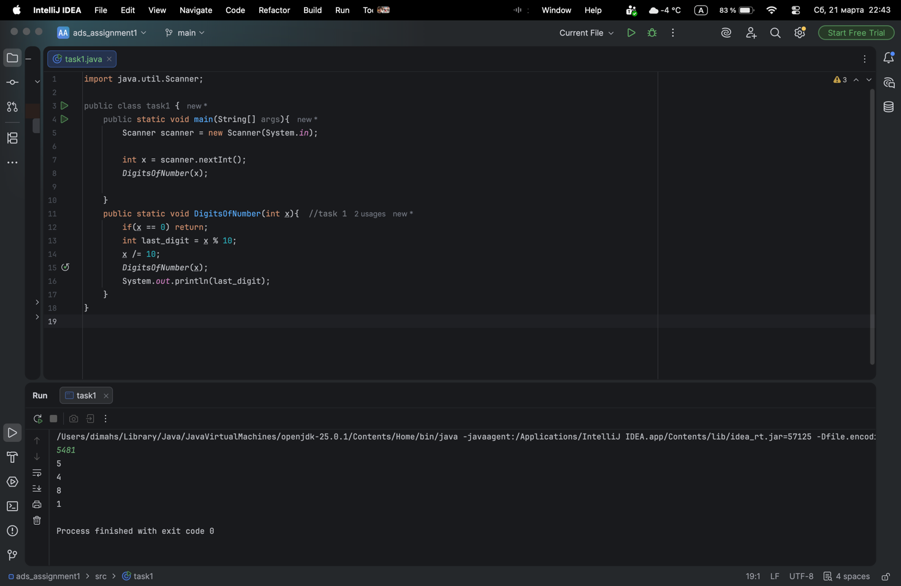
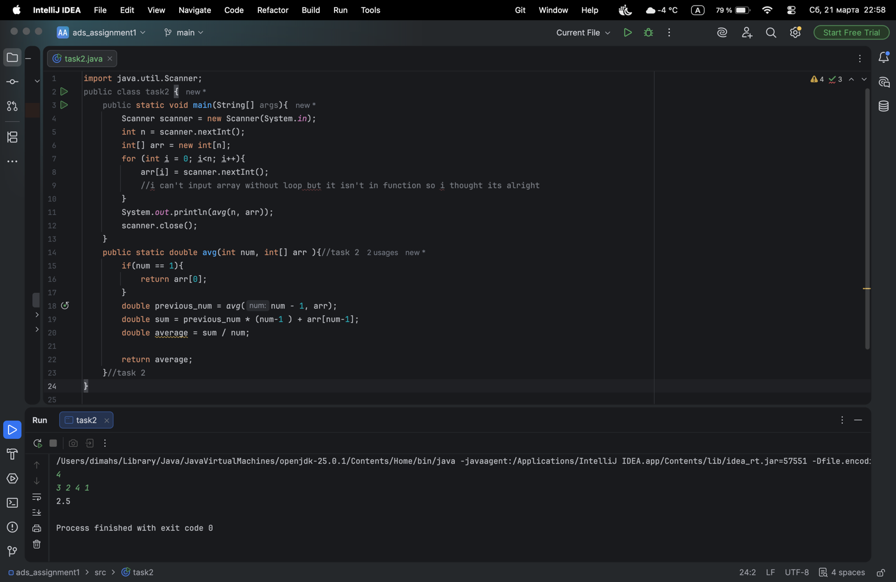
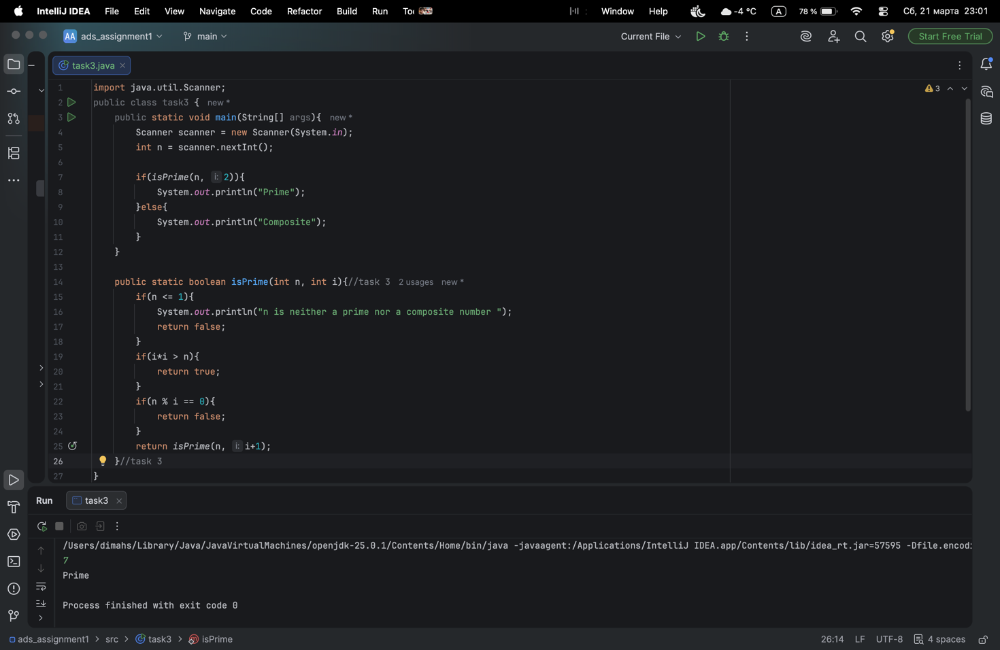
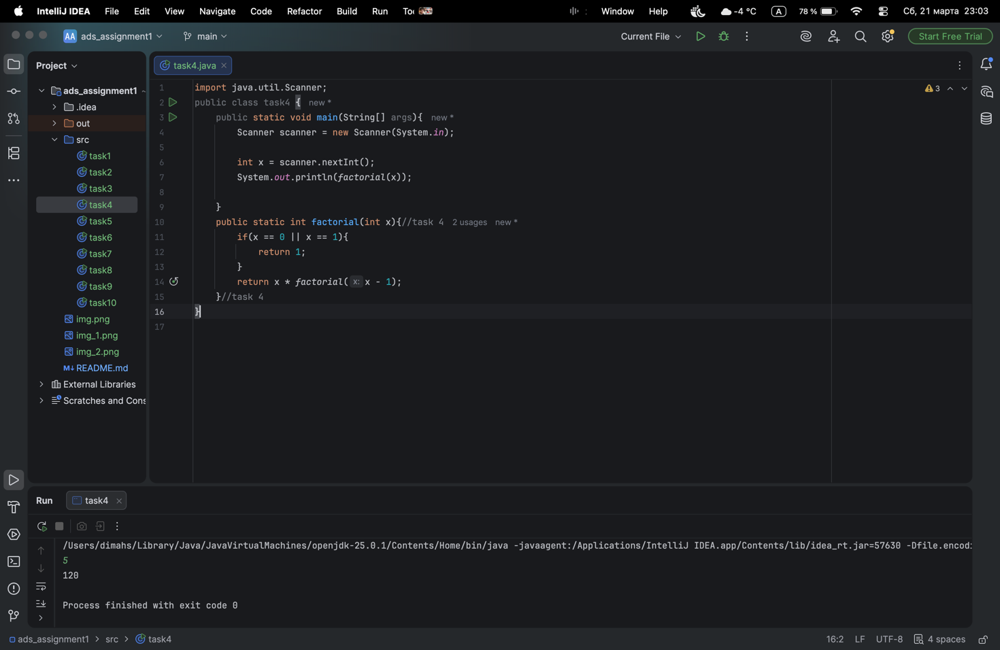
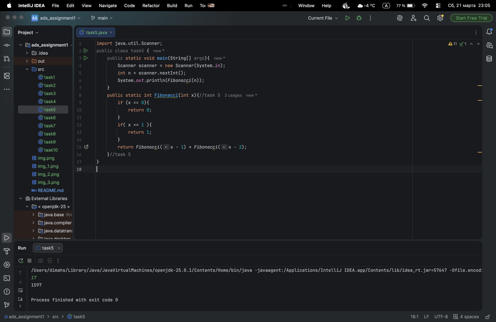
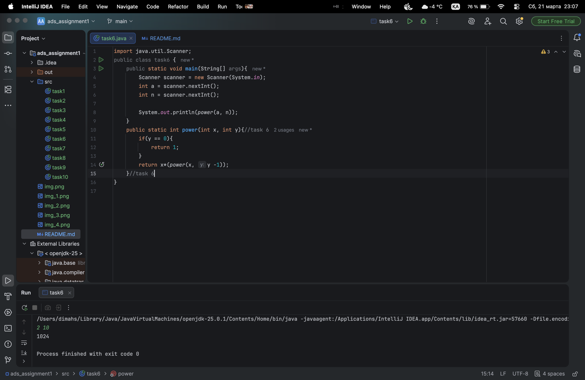
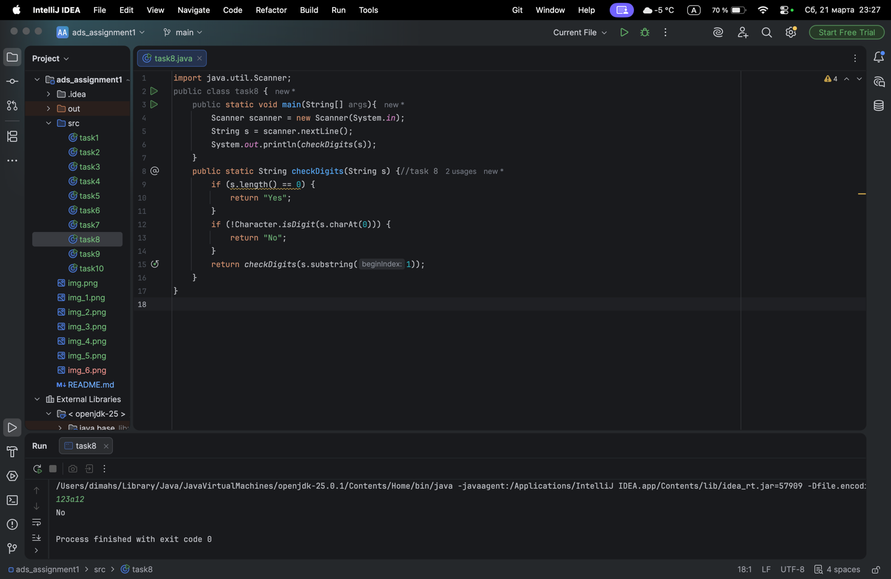
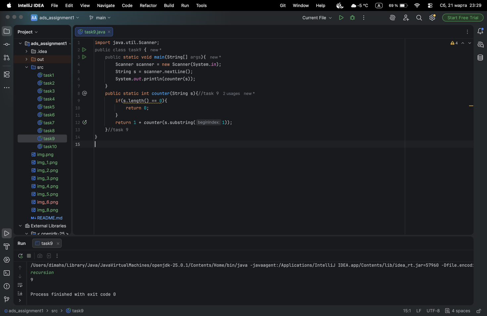
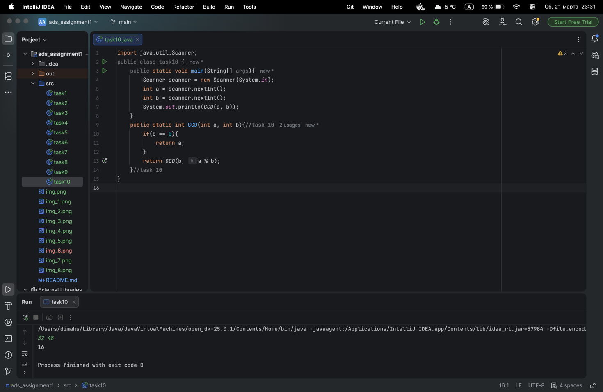

# ads_assignment
**Name**: Sydykov Dinmukhamed \
**Group**: IT-2502

---
## PART 1

  ## TASK 1 - Print Digits of a Number 
  
  **I solved a problem by using recursion and repeatedly dividing number by 10 to execute digits by one, and printing digits after recursion that outputs digits in correct order**

  ## **TASK 2** - **Average of elements**
  
  **I solved this task using recursion by calculating the average step by step. First, I take the previous result, turn it into sum, add next number, and then divide by how many elements I have now.**

  ## **TASK 3** - **Prime number check**
  
  **I solved this task using recursion by checking if the number can be divided by smaller numbers starting from 2. If no divisor is found until i*i > n, I say the number is prime, otherwise it is composite.**

  ## **TASK 4** - **Factorial**
  
  **I solved this task using recursion by multiplying the number by the factorial of the previous number. The recursion stops when the number becomes 0 or 1, where the result is 1.**

---

## **PART 2**

  ## **TASK 5** - **Fibonacci number**
  
  **I solved this task using recursion by adding two previous Fibonacci numbers to get the next one. The recursion stops when the number is 0 or 1, because these are base cases.**

  ## **TASK 6** - **Power function**
  
  **I solved this task using recursion by multiplying the number by itself y times. The recursion stops when the power becomes 0, because any number to power 0 is 1.**

  ## **TASK 7** - **Reverse output**
  
  **I solved this task using recursion by printing the last element first and then calling the function for the remaining elements. This way, the numbers are printed in reverse order without using another array.**

---

## **PART 3** 

  ## **TASK 8** - **Check digits in string**
  
  **I solved this task using recursion by checking each character one by one. If all characters are digits, it returns “Yes”, but if it finds a non-digit, it returns “No”.**

  ## **TASK 9** - **Count characters in string**
  
  **I solved this task using recursion by removing one character at each step and adding 1 to the count. The recursion stops when the string becomes empty, and then returns 0.**

  ## **TASK 10** - **Greatest Common Divisor**
  
  **I solved this task using recursion and the Euclidean algorithm by repeatedly replacing the numbers with (b, a % b). The recursion stops when b becomes 0, and then the result is the GCD.**

